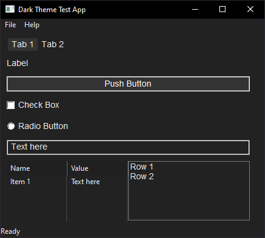

# Dark Theme for Win32API GUI Apps

A single-file C library for adding dark theme support to Win32 GUI applications.
Requires Windows 10 or later.



## Quick Start

```c
#include <windows.h>
#include "dark-theme.h"
#include "dark-theme.c"

struct dark_theme dt = {};

if (!dark_theme_init(&dt, 0)
    && DARK_THEME_DARK == dark_theme_ctl(&dt, DARK_THEME_QUERY, 0)) {

    // Set custom colors (RGB)
    dark_theme_colors(&dt, 0x222222, 0xeeeeee);

    // Apply dark theme for the application
    dark_theme_ctl(&dt, DARK_THEME_APP, 0);

    // Apply for the window
    dark_theme_ctl(&dt, DARK_THEME_WINDOW_TITLE, hWindow);
    dark_theme_ctl(&dt, DARK_THEME_WINDOW_MAIN_MENU, hWindow);
    dark_theme_ctl(&dt, DARK_THEME_WINDOW, hWindow);
}
```

Apply dark theme to individual controls:

```c
dark_theme_ctl(&dt, DARK_THEME_BUTTON, hButton);
dark_theme_ctl(&dt, DARK_THEME_CHECKBOX, hCheckbox);
dark_theme_ctl(&dt, DARK_THEME_EDIT, hEdit);
dark_theme_ctl(&dt, DARK_THEME_TAB, hTab);
dark_theme_ctl(&dt, DARK_THEME_LISTVIEW, hListView);
dark_theme_ctl(&dt, DARK_THEME_STATUSBAR, hStatusBar);
```

## Building the Example App

```bash
cd example && make
```

## API Reference

### dark_theme_init

`int dark_theme_init(struct dark_theme *theme, unsigned flags)`

Initialize the dark theme context.
Loads the required functions from `uxtheme.dll` and `dwmapi.dll`.

* **theme**: Zero-initialized `struct dark_theme` pointer
* **flags**: Reserved for future use (pass 0)
* **Returns**: 0 on success, non-zero on error

### dark_theme_ctl

`int dark_theme_ctl(struct dark_theme *theme, unsigned flags, HWND h)`

Apply theme settings to a window or control.

* **theme**: Initialized theme context
* **flags**: Value from `enum DARK_THEME_FLAGS`
* **h**: HWND of the target window/control (ignored for `DARK_THEME_APP`, use 0)
* **Returns**: 0 on success, -1 on error

### DARK_THEME_FLAGS

| Flag | Description |
|------|-------------|
| `DARK_THEME_QUERY` | Query the system's current color theme. Returns `DARK_THEME_LIGHT` or `DARK_THEME_DARK`. |
| `DARK_THEME_APP` | Enable dark mode for the entire application process |
| `DARK_THEME_WINDOW_TITLE` | Dark title bar via DWM |
| `DARK_THEME_WINDOW` | Dark window background and child control colors |
| `DARK_THEME_WINDOW_MAIN_MENU` | Main Menu with custom highlight colors |
| `DARK_THEME_BUTTON` | Button |
| `DARK_THEME_CHECKBOX` | Check Box |
| `DARK_THEME_EDIT` | Edit control |
| `DARK_THEME_TAB` | Tab control with custom highlight colors |
| `DARK_THEME_LISTVIEW` | ListView with custom header/text colors |
| `DARK_THEME_STATUSBAR` | Status Bar |

### dark_theme_colors

`void dark_theme_colors(struct dark_theme *t, unsigned background, unsigned text)`

Set background and text colors.
The function also sets the colors for tab or menu highlighting automatically.

* **background**: Background color in RGB
* **text**: Text color in RGB
